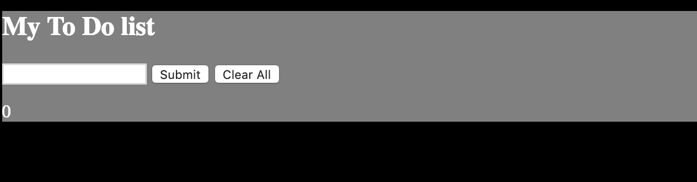

# My Awesome Project
For this project I made a todo list. The user can add things to the list and remove them.

## How It's Made:

I made this web application with both JavaScript, HTML, and CSS. The user can click the buttons "Submit" or "Clear All" to submit their task into the list or to clear everything from the list.

## Lessons Learned:

While making this web application I learned how to properly use multiple functions with a loop.
